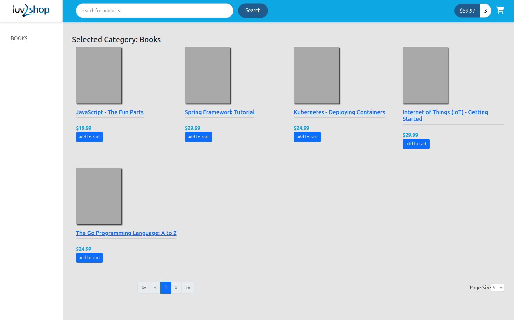
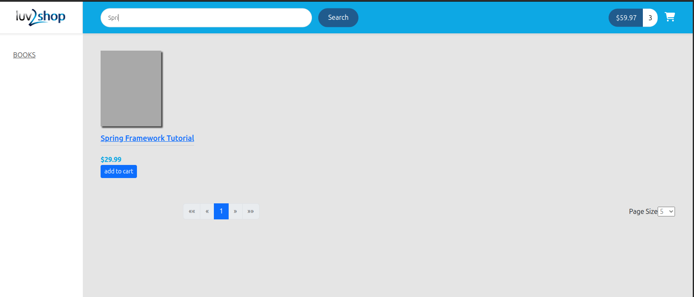
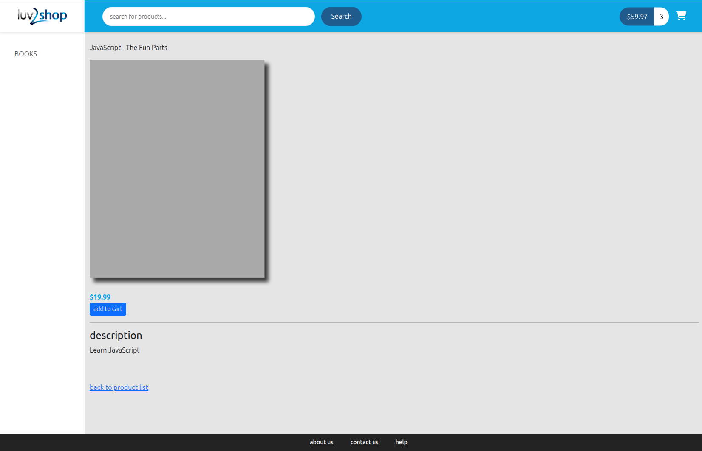
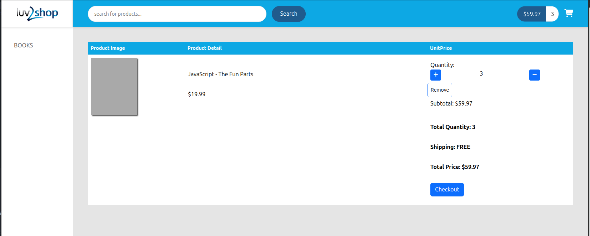
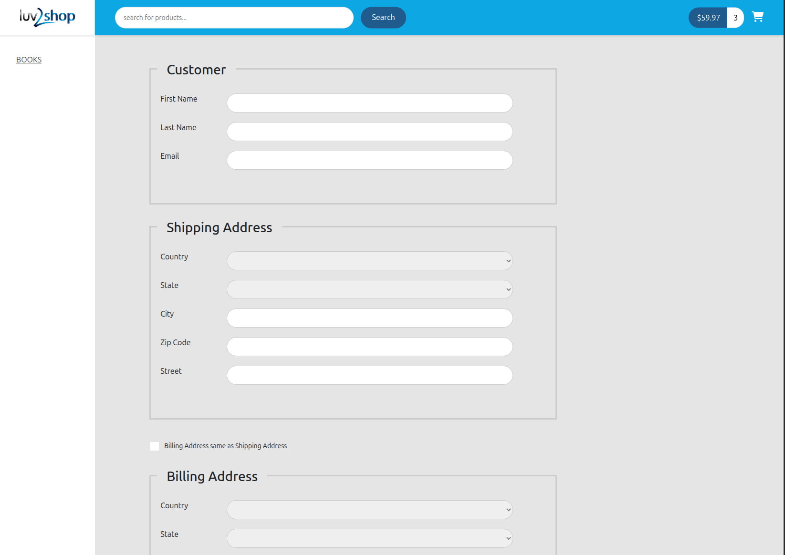

# AngularEcommerce

## Features

- Loads product list from database
- Add items to your cart (saved in sessionsStorage such that site refresh does not empty your cart)
- Add or remove items from your cart
- Checkout, fill in information for the payment process (handled via Stripe)
- User login via Okta+Oauth2+OpenID; Once logged in, users can see previous order history and access membership only content
- Filter and search functions such as different product categories

### Home

### Search

### Details

### Checkout

### Billing

## Technologies Used

- Angular
- Okta
- Stripe
- Bootstrap

